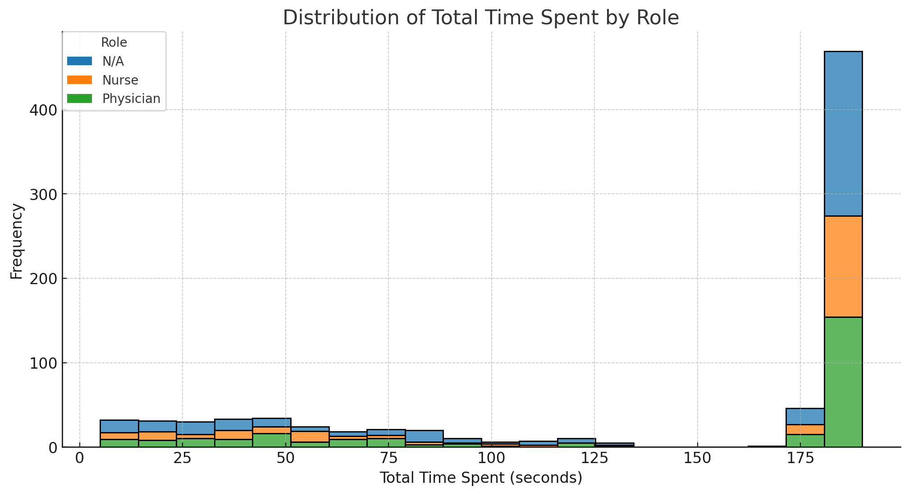
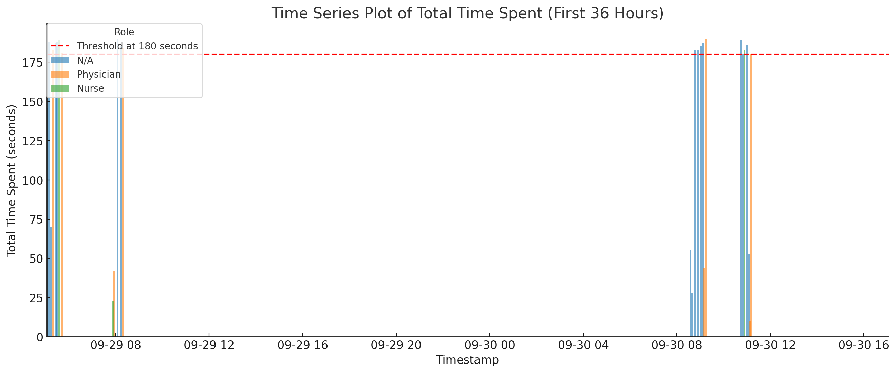

This is a data generator for Maltas measurement device. 

The script can be used to generate simulated hand hygiene compiance data for an operating room for desired time span.

# Fields 

Description of the CSV fields:

1. measurement_id: A unique identifier for each measurement event (may have several rows).
1. device_id: An identifier for the device on which the measurement was taken.
1. role_id: An integer identifier for the role involved in the event.

    1. 0 = N/A (not selected)
    1. 1 = Nurse
    1. 2 = Physician

1. start_time_iso: The ISO-formatted timestamp indicating when an event started.
1. end_time_iso: The ISO-formatted timestamp indicating when an event ended.
1. total_time_spent: The total duration of the measurement in seconds.
1. status: The status of the event.
    * "STARTED": The measurement has started.
    * "PAUSED": The measurement was temporarily halted.
    * "CONTINUED": The measurement resumed after being paused.
    * "INTERRUPTED": The measurement was stopped before completion.
    * "COMPLETE": The measurement successfully reached completion.

These descriptions should give you a comprehensive understanding of each event recorded in the dataset.
More status messages (such as "INTERACTED" may be added at later time.

The schema for device is not given as it does not yet exist. It would have information of the version, when it was last seen, and who is the customer (and hence users) that are allowed to see the data.

# Use

Call with:

```console
$ python datagen.py > data.csv
```
By default this generates one month of data from the current date for device with id 1. One can set arguments (see `--help) to change this default behaviour.

# Data

Some sample plots of the sample data.






# Implementation details

The generator itself is very ugly throwaway code and should not be studied.

It simulates five sorts of users
1. Ones that use the device for over 180 seconds as should and complete the measurement.
2. Those that start but interrupt.
3. Those that start, then pause the measurement, sometimes repeatedly, but get back in time to continue to complete the measurement.
4. Those that start, then pause the measurement, sometimes repeatedly, but get back only to interrupt the measurement before 180 seconds is full.
5. Those that start, then pause the measurement, interrupt, and start another measurement because the last was interrupted by accident. The second measurement might get interrupted or not.

The operating theater is simulated so that the staff uses the device in turns before the surgery starts. The surgery takes some time, sometimes another starts right after, but not always. Sometimes there are longer surgeries.


